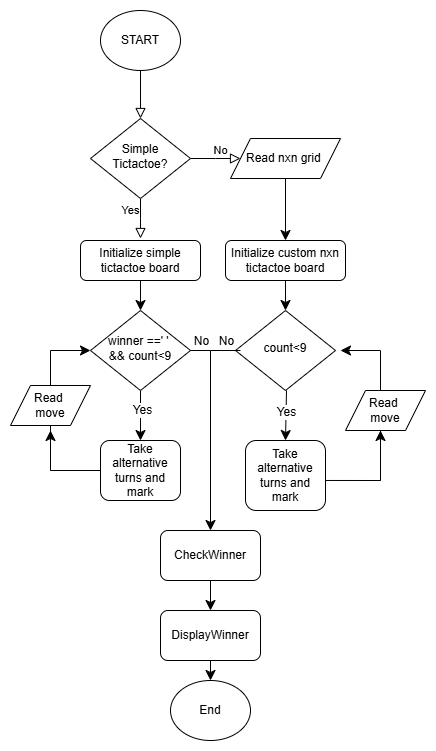

# Tic-Tac-Toe AI Project

## Summary

This practical aimed to make a Tic-Tac-Toe game by using java and C where we implemented two players and AI which never loses respectively. I implemented the game with support of AI (bot playing against human which never loses) in simple game using C and two players functionality in simple game as well as custom grid game where the game doesn’t stop until it has no grid remaining which counts no. of rows of same mark in java. I learned how to make a decision making algorithm like **minimax** algorithm and how it works when tackling a problem with heuristics.

**Keywords** — TicTacToe, Java, Two-Player Game, Minimax Algorithm, C

---

## I. Problem Description

A simple Tic-tac-toe board game where two players can play turn by turn should be created using two classes. An AI algorithm should be used to make it play Tic-tac-toe such that it never loses. It should also be visualized correctly so user can play it without much complexities.

---

## II. Background

### A. Tic-Tac-Toe  
This is a very simple board game which is popular around the world. This has simple rules that can be understood by many. It has 3 rows and 3 columns which means we can simulate it using 2d array. The possibilities of choices where you can mark reduces as the moves made increases. There are three end game scenarios i.e. win, lose or draw. Win occurs when you get 3 same O's or X's in a row horizontally, vertically or diagonally. Lose is when your opponent does the same and draw is when none do it and moves available ends.

### B. TicTacToe Bot  
he game is easy for a computer (bot) to win against a human opponent as it has resources it can utilize to memorize far more data than a human at a time. Such bots can be made by using various algorithms like hillclimbing, minimax,,etc which has their own advantages. We used **minimax** so that we maximize the gain of computer AI and minimize the gain of players where it considers both bot and player to be playing optimally. Why do we call god powerful? Because the god is omniscient who knows the start and end similarly the bot knows the start and the end with all the possibilities.

---

## III. Program Description

First the engine starts with asking user if he/she wants to play simple tic-tac-toe with predefined existing rules. If yes, then it proceeds with initializing simple tic-tac-toe board with 3 rows and 3 columns else it asks for n grid or rows then makes nxn grid tic-tac-toe with n rows and n columns. This has its own set of rules where game wont stop until all chances are used. Then if simple game if checks for winner every time and checks for count until when it alternates turns for mark and read move then updates the board. Then it checks winners and displays the winner to make the TTTengine stop.

---

## IV. Implementation

### A. `TicTacToe` Class (Java)  
Handles board setup, win conditions, and game status.

- `public TicTacToe(int n)`: Initializes a custom `n×n` board.  
- `public int getXgot3()`: Returns the score of X (number of rows with 3 Xs).  
- `public boolean isCustomGridGame()`: Returns whether a custom grid is used.

### B. `TTTGame` Class (Java)  
Manages moves, turns, and interaction with the board.

- `public TTTGame()`: Initializes a standard game.  
- `public TTTGame(int n)`: Initializes a custom grid game.

### C. `TictactoeWithAi.c` (C)  
Implements minimax-based AI with a menu setup for Ubuntu, supporting two-player and AI modes.

- `int minimax(int isMaximizing)`: Recursively simulates all moves and scores them.  
- `void aiMove()`: Determines the best move using minimax.  
- `char checkWin()`: Checks board status — 1 (AI win), -1 (player win), `' '` (draw).

---

## V. Tests and Results

I tested the AI by giving random inputs, giving best moves possible and playing against it repeatedly but all in all lost them all. Then I printed the decisions AI was thinking which further solidified how it was eliminating all decisions that would lead it to loss and choosing the ones where it would prevail. I tested the win conditions for expanded tic-tac-toe with custom rules by playing both sides and making different wins and displaying the no of rows of O's and X's where it could be tracked and debugged if any issue occurred. Making horizontal rows, vertical and diagonal for testing and knowing if simple tic-tac-toe was working.

---

## VI. Lessons Learnt

I learnt about making an AI and implementation of minimax algorithm. I learnt about representing grid based knowledge by use of matrices and two player games where I made turn available. I learnt about implementing custom rules where I expanded the tic-tac-toe and expanded the game winning rules to be different than original simply by changing conditions of winning and checking 3x3 each time till it covers entire grid. I learnt the inner working of classic decision making AI.
 Implementing the new rule where nxn had to be checked for rows of O's and X's was a challenging task. It incurred many errors, bugs and logical problems during its coding. It would sound fine during planning but in implementation and testing would still have holes. 
This program can be improved in different ways. From perspective of UI/UX an addition of interfaces, colors, window, animations would look amazing. From perspective of networking, it can expanded into lan for two player or through internet. Ai implemented can be made to have different levels of difficulty like easy medium and impossible where easy and medium can give humans a chance of winning by decreasing the capability of ai. 

-----------------
